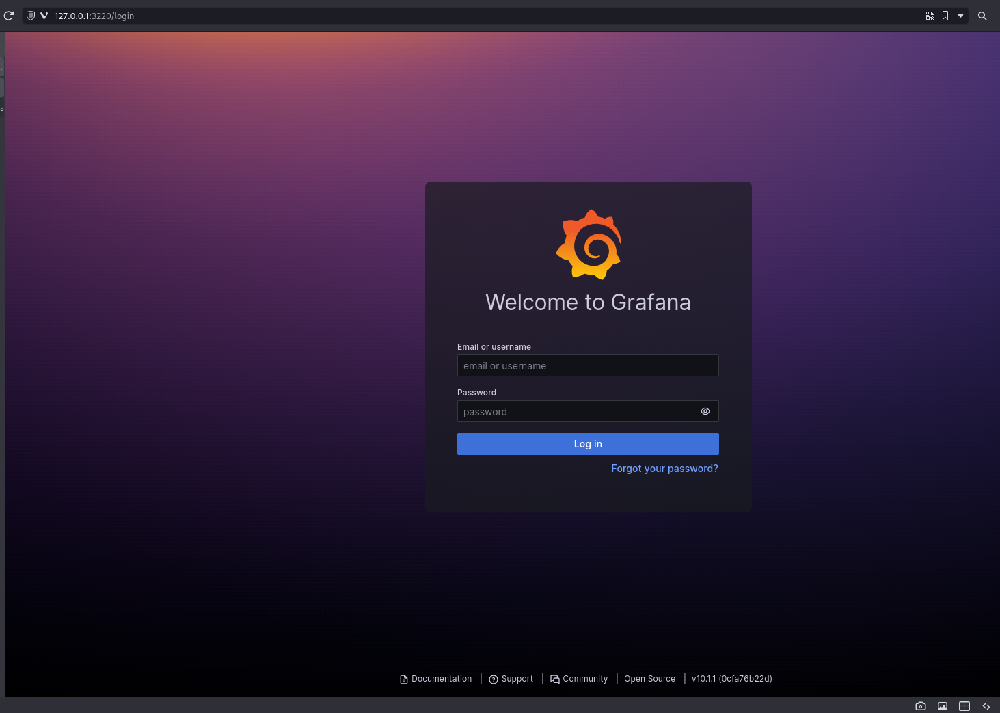
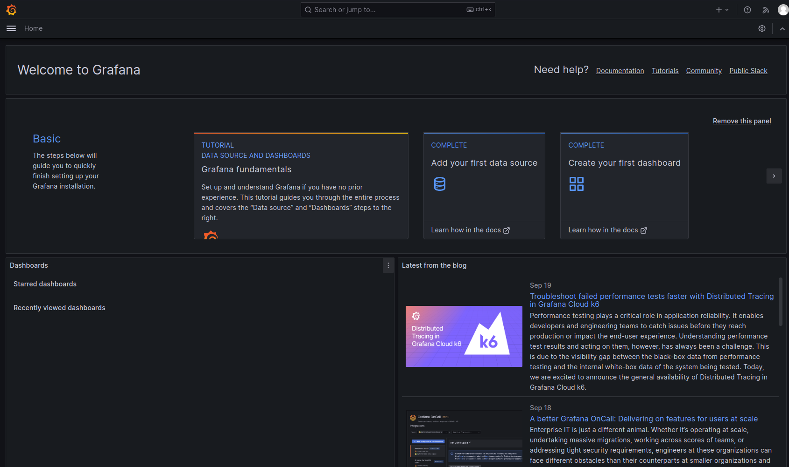
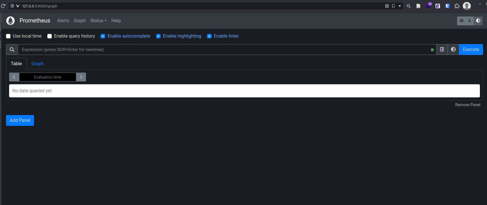

# Implementation of the Ignite.Dev Internship Task

## Task Instructions

### Setup a kubernetes cluster using kind

1. Write a simple bash script that deploys a [kind](https://kind.sigs.k8s.io/docs/user/quick-start/) cluster locally
2. Download the kubeconfig for the cluster and store in a safe place, we will use it much later in the next steps

### Deploy a sample Node.js app using terraform

1. When kind is up and running, dockerize a simple hello world [express](https://expressjs.com/en/starter/hello-world.html) and deploy to dockerhub
2. create a kubernetes deployment manifest to deploy to deploy the Node.js to the kind cluste but don't apply it yet
3. using the [kubectl terraform provider](https://registry.terraform.io/providers/gavinbunney/kubectl/latest/docs), write a terraform code to deploy the kubectl manifest to the kind cluster

### Bonus

1. Using the [kube-prometheus stack](https://github.com/prometheus-community/helm-charts/blob/main/charts/kube-prometheus-stack/README.md), using [terraform helm provider](https://registry.terraform.io/providers/hashicorp/helm/latest/docs), setup monitoring and observability for the prometheus cluster.

---

## My Implementation Documentation

### To follow along, please note

1. **Linux Environment**: You need a Linux/Unix environment to run the commands mentioned in this guide. You can use WSL or a virtual machine if you're on Windows.

2. **Docker**: Make sure Docker is installed on your machine as it is required to run Kubernetes in Docker (kind).

3. **kubectl**: Install `kubectl`, the Kubernetes command-line tool, to interact with your Kubernetes cluster. See the [Docs](https://kubernetes.io/docs/tasks/tools/) for installation guide.

4. **Terraform**: Install Terraform for infrastructure provisioning. I use [tfenv](https://github.com/tfutils/tfenv) to install and manage Terraform versions.

5. **Node.js**: Install Node.js if you haven't already. See the [Docs](https://nodejs.org/) for installation guide.

6. **DockerHub Account**: Create a [DockerHub](https://hub.docker.com) account if you don't have one to push your Docker images.

## Step 1: Setup a Kubernetes Cluster using kind

- Install `kind`

    ```bash
    # Install kind (Kubernetes in Docker)
    [ $(uname -m) = x86_64 ] && curl -Lo ./kind https://kind.sigs.k8s.io/dl/v0.20.0/kind-linux-amd64
    chmod +x ./kind
    sudo mv ./kind /usr/local/bin/kind
    ```

## Step 2: Write a Bash Script for Cluster Deployment

- We will create the Kind cluster with a configuration file that will specify appropriate DNS configurations that allows pulling of images. Create a file called `cluster_config.yaml` and insert the following code:

    ```yml
    ---
    kind: Cluster
    apiVersion: kind.x-k8s.io/v1alpha4
    nodes:
    - role: control-plane
    extraPortMappings:
    - containerPort: 53
        hostPort: 53
        protocol: UDP
    - containerPort: 53
        hostPort: 53
        protocol: TCP
    ```

- Create a Bash script to automate the cluster deployment process. The script will also *download the kubeconfig for the cluster for use later.* Let's call it `ignite_cluster.sh`:

    ```bash
    #!/bin/bash

    # Create a Kubernetes cluster with kind
    kind create cluster --config ./cluster_config.yaml  --name ignite-cluster

    # Download kubeconfig
    mkdir -p ~/.kube
    kind get kubeconfig --name ignite-cluster > ~/.kube/config
    ```

- Make the script executable:

    ```bash
    chmod +x ignite_cluster.sh
    ```

- Run the script:

    ```bash
    ./ignite_cluster.sh
    ```

## Step 3: Dockerize a Simple Express App and Push to DockerHub

- Create a simple `Hello Word` Node.js/Express app with the following steps
  - Create a directory named `ignapp` and `cd` into it
  - Run `npm init`
  - Install `express` by running `npm install express`
  - Create a file named `ignapp.js` and insert the following code:

  ```js
    const express = require('express')
    const app = express()
    const port = 3210

    app.get('/', (req, res) => {
    res.send('Hello World!')
    })

    app.listen(port, () => {
    console.log(`Example app listening on port ${port}`)
    })
  ```

  - Run `node ignapp.js` and use postman to send a GET request to `localhost:3210` to get `Hello World` as a response.

- Now, Dockerize it! Create a `Dockerfile` in the `ignapp` directory and insert the following code:

    ```Dockerfile
    # Use an official Node.js runtime as the base image
    FROM node:20-alpine

    # Set the working directory in the container
    WORKDIR /app

    # Copy package.json and package-lock.json to the working directory
    COPY package*.json ./

    # Install app dependencies
    RUN npm install

    # Copy the rest of the application code to the working directory
    COPY . .

    # Expose port 3210
    EXPOSE 3210

    # Define the command to run the application
    CMD ["node", "ignapp.js"]
    ```

- Build and push the Docker image:

    ```bash
    docker build -t <your-dockerhub-username>/ignapp:1.0 .
    docker push <your-dockerhub-username>/ignapp:1.0
    ```

## Step 4: Create a Kubernetes Deployment Manifest

- Create a directory called `ign_deployment` to hold our deployment code.
- Within the `ign_deployment`, create a Kubernetes deployment manifest file called `ign_k8s_deployment.yaml` for our app. Insert the following code which will pull our image from docker hub and deploy into the cluster:

    ```yaml
    ---
    apiVersion: apps/v1
    kind: Deployment
    metadata:
    name: ignapp
    spec:
    replicas: 3
    selector:
        matchLabels:
        app: ignapp
    template:
        metadata:
        labels:
            app: ignapp
        spec:
        containers:
            - name: ignapp
            image: dankuta/ignapp:1.0
            ports:
                - containerPort: 3210
    ---
    apiVersion: v1
    kind: Service
    metadata:
      name: ignapp-service
    spec:
      selector:
        app: ignapp
      ports:
      - protocol: TCP
        port: 3210
        targetPort: 3210
    ```

## Step 5: Deploy the Node.js App to the Kubernetes Cluster using the Deployment Manifest and Terraform

- Create a Terraform configuration to deploy the Kubernetes manifest created above using the `kubectl` Terraform provider. Add the following to your `main.tf`. Your Terraform configuration can be structured thus within the `ign_deployment` directory:

    ```hcl
    ign_deployment/
    ├── main.tf
    └── variables.tf
    ```

    > Remember to add the variable for the kubernetes config path. This is how Terraform would know what cluster to deploy into.

    ```hcl
    terraform {
    required_version = ">= 0.13"

    required_providers {
        kubectl = {
        source  = "gavinbunney/kubectl"
        version = ">= 1.7.0"
        }
    }
    }

    provider "kubectl" {
    load_config_file = true
    config_path      = var.kube_config_path
    }

    resource "kubectl_manifest" "ignapp" {
    yaml_body = file("${path.module}/ign_k8s_deployment.yaml")
    }
    ```

- Run `terraform init`, `terraform plan`, and `terraform apply` to deploy the app into `ignite_cluster`

## Step 6: Using Helm and Terraform, Install Kube-Prometheus in the Cluster for Monitoring and Observability

- First ensure `Helm` is installed. See the [Docs](https://helm.sh/docs/intro/install/) to use the installation guide.
- We will use [kube-prometheus-stack](https://github.com/prometheus-community/helm-charts/blob/main/charts/kube-prometheus-stack/README.md) which will install all the necessary tools we need right now such as `Prometheus`, `Grafana`, `AlertManager`, and `Prometheus Node Exporter`.
- To install this using Terraform and Helm, we will add the helm terraform provider to our Terraform configuration:

    ```hcl
    provider "helm" {
        kubernetes {
            config_path = var.kube_config_path
        }
    }
    ```

- Add a new `helm_release` resource block to `main.tf`:

    ```hcl
    resource "helm_release" "kube_prom" {
        name       = "kube-prometheus-stack"
        chart      = "prometheus-community/kube-prometheus-stack"
    }
    ```

- Before running `terraform init`, ensure you have added the `kube-prometheus-stack` repository:

    ```bash
    helm repo add prometheus-community https://prometheus-community.github.io/helm-charts 
    helm repo update
    ```

- Run `terraform init`, `terraform plan`, and `terraform apply` to deploy `kube-prometheus-stack` into `ignite_cluster`

## Step 7: Setup Monitoring and Observability of the Cluster with Prometheus and Grafana

- After the Terraform deployment is successful, you should have kube-prometheus up and running in your Kubernetes cluster.
- To access the monitoring stack, you can use port forwarding to access the Grafana dashboard, Prometheus, and other components. Run each of these commands in a new terminal tab:

   ```bash
   kubectl port-forward deployment/kube-prometheus-stack-grafana 3220:3000
   kubectl port-forward deployment/kube-prometheus-stack-prometheus 9090:9090
   ```

- Access Grafana in your web browser at <http://localhost:3220>. Default username is `admin` and default password is `prom-operator`.
  
  
- Access Prometheus in your web browser at <http://localhost:9090>.
  
- By default, using this deployment, Prometheus scrapes data from the cluster using ServiceMonitor and also by default Grafana is connected to- and draws on Prometheus as a data source.

## Step 8: Configure Monitoring and Observability of the IgnApp

- Using Helm, we will install `Prometheus BlackBox Exporter` to fetch data from the `ignapp` endpoint, translate the data to Prometheus Metrics, and expose the `/metrics` endpoint. The Helm chart will also Create a service for connecting to the exporter, and Configure ServiceMonitor with the `values` we pass to it so Prometheus can discover the exporter.
